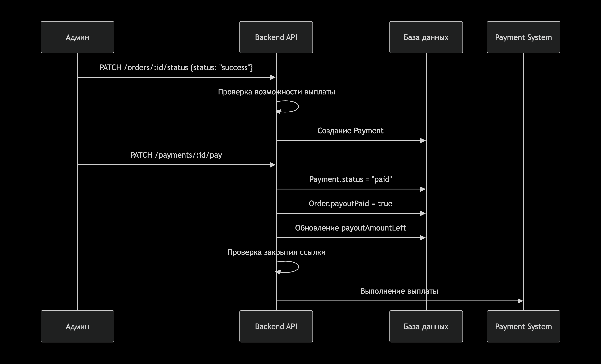
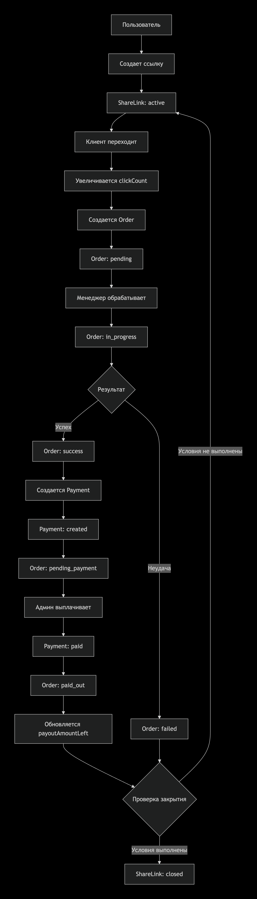
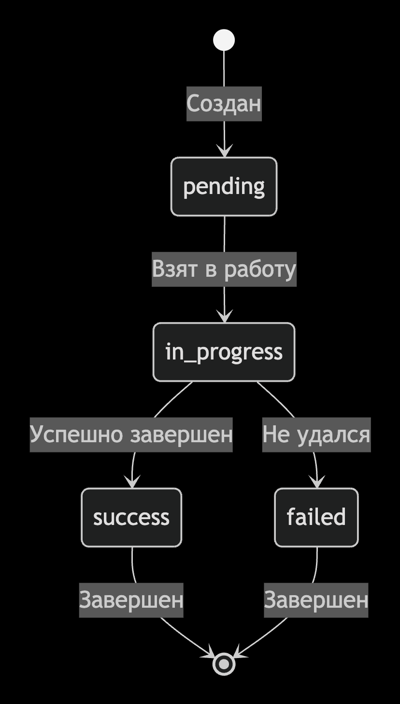
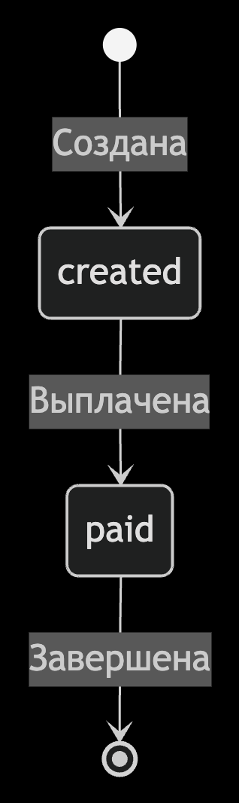
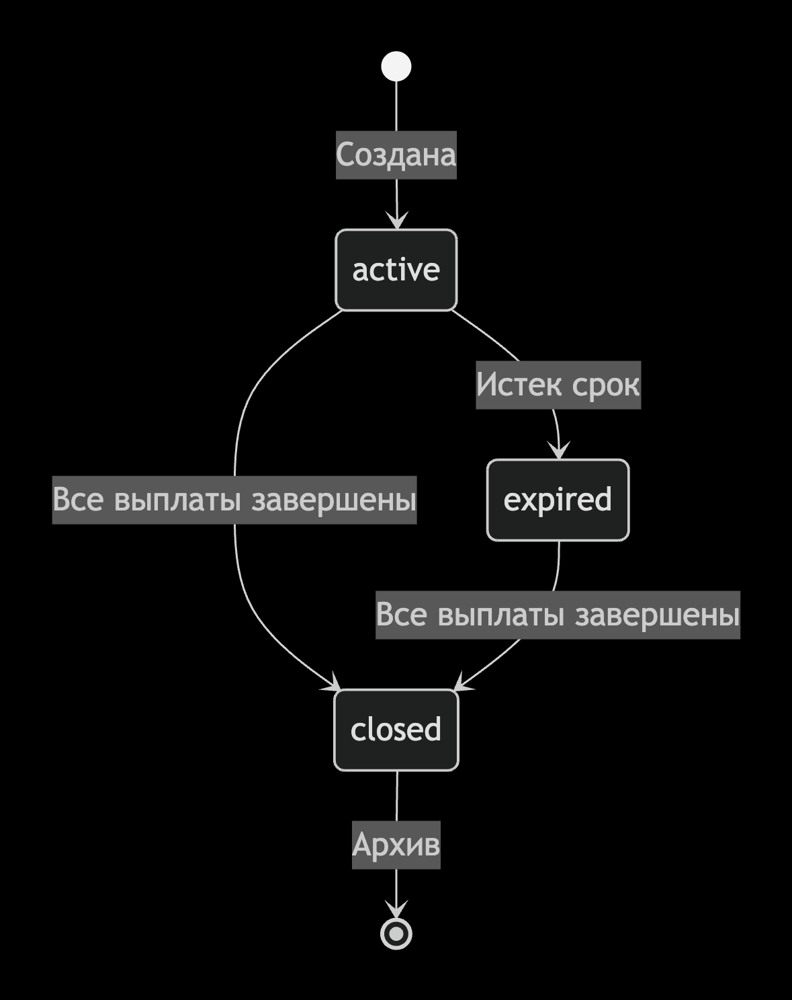

# Система реферальных ссылок и сделок

## Полное описание архитектуры, API и механизмов учёта переходов, заказов и выплат.

## 📌 Описание проекта

Система позволяет пользователям мобильного приложения генерировать уникальные ссылки для 공유 товара.
Каждая ссылка живёт 24 часа и привязана к конкретному пользователю и продукту.
Пользователь может:

- делиться ссылками в соцсетях;
- отслеживать статистику по каждой ссылке;
- видеть количество переходов и успешных сделок;
- получать выплаты за успешные сделки по своим ссылкам.
  Переходы происходят на веб-приложение, где пользователь может оставить заявку — из неё создаётся заказ.
  Админ управляет статусами сделок и осуществляет выплаты.

---

{width=1200px}
{width=1200px}


# 🧩 Структура системы

## 1. Создание ссылки (мобильное приложение → API → БД)

User (mobile)
|
v
[POST /share-links]
|
v
Back-end:

- генерирует referralCode
- status = "active"
- expiryDate = now + 24h
- clickCount = 0
- payoutAmountLeft = referralBonus + extraBonus
  |
  v
  DB: ShareLinks
  |
  v
  JSON Response:
  {
  "referralCode": "ABC123",
  "productId": 105,
  "expiryDate": "2025-11-16T12:34:56Z",
  "status": "active",
  "clickCount": 0,
  "payoutAmountLeft": 500
  }

## 2. Переход по ссылке (веб → API → React App)

Client Browser → /r/:referralCode
|
v
[GET /share-links/:referralCode]
|
v
Back-end:

- проверяет exists?
- проверяет expiryDate?
- если истекло → { status: "expired" }
- если ок:
  clickCount++
  вернуть:
  - productId
  - categoryName
  - referralCode
    ProductRedirect → navigate('/products/:category/:id', state: { referralCode })

## 3. Пользователь оставляет заявку → создаётся Order

Client → [POST /orders]
body: { name, phone, productId, referralCode }
|
v
Back-end:

- ищет ShareLink
- создаёт Order:
  status = "pending"
  shareLinkId
  amount = product.price
  referralReward = product.referralBonus + product.extraBonus - обновляет ShareLink.totalOrders++

## 4. Работа менеджера / риелтора

Менеджер → AdminPanel → меняет Order.status:
pending → in_progress
in_progress → success / failed

## 5. Создание Payment по успешному заказу

если Order.status = success:
|
v
создаём Payment: - orderId - shareLinkId - amount = order.referralReward - status = "created"
|
v
Order.status = pending_payment

## 6. Выплата (Payment.paid). После фактического перечисления:

[Payment paid]
|
v
Back-end:

- Payment.status = "paid"
- Order.payoutPaid = true
- Order.status = "paid_out"
- sumPayments = SUM(Payments where shareLinkId)
- ShareLink.payoutAmountLeft = shareLink.totalPayout - sumPayments
  |
  v

условия закрытия ссылки:

- payoutAmountLeft == 0
- Orders со статусами failed или paid_out
- (expiryDate < now) ИЛИ (все выплаты произведены)
  |
  v
  если Да → ShareLink.status = "closed"

# ✔️ СХЕМА СВЯЗЕЙ МЕЖДУ МОДЕЛЯМИ

User
|
| 1 - M
v
ShareLink
|
| 1 - M
v
Orders
|
| 1 - 1 (или 1 - M, если split payments)
v
Payments

# ✔️ СХЕМА ДВИЖЕНИЯ ДЕНЕГ И СТАТУСОВ

## Order.status

pending → клиент оставил заявку
in_progress → передано специалисту
failed → сделка не состоялась
`success` → Сделка закрыта успешно, подтверждена менеджером
`pending_payment` → Заказ успешно закрыт и передан на выплату
`paid_out` → Выплата фактически произведена исполнителю



## Payment.status

created → начислено/ к выплате
paid → выплачено исполнителю



## ShareLink.status

active → работает, можно переходить
expired → время ссылки прошло, но есть заказы
closed → все заказы закрыты, все выплаты сделаны



# ✔️ ЗАПРОСЫ API (единая структура)

# ShareLinks

## Создать ссылку

POST /share-links
{
"productId": 105
}

## Проверить и получить товар

GET /share-links/:referralCode

## Получить ссылки пользователя

GET /users/:id/share-links

# Orders

## Создать заказ

POST /orders
{
"name": "Иван",
"phone": "+79998887766",
"productId": 105,
"referralCode": "ABC123"
}

## Обновить статус

PATCH /orders/:id/status
{
"status": "in_progress"
}

# Payments

## Создать платёж

POST /payments
{
"orderId": 530,
"amount": 1500
}

## Выплатить

PATCH /payments/:id/pay
добавить описание и сделать чисто на readme.md

Diagram

USERS {
int id PK
string name
string email
string phone
string role // user | partner | manager | admin
datetime createdAt
datetime updatedAt
}

SHARELINKS {
int id PK
int userId FK
int productId
string referralCode
string status
datetime expiryDate
int clickCount
float payoutAmountLeft
int totalOrders
}

ORDERS {
int id PK
int shareLinkId FK
string name
string phone
int productId
float amount
float referralReward
string status
bool payoutPaid
datetime createdAt
}

PAYMENTS {
int id PK
int orderId FK
int shareLinkId FK
float amount
string status
datetime createdAt
}

USERS ||--o{ SHARELINKS : "1 - M"
SHARELINKS ||--o{ ORDERS : "1 - M"
ORDERS ||--|| PAYMENTS : "1 - 1"

```

```
